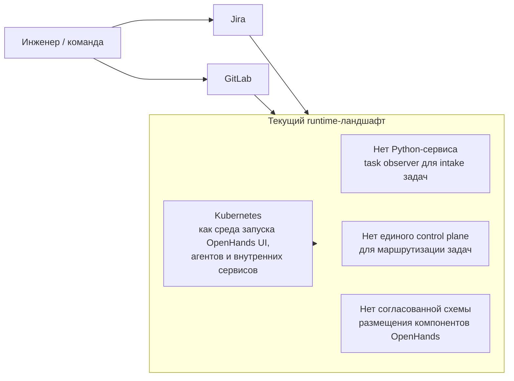
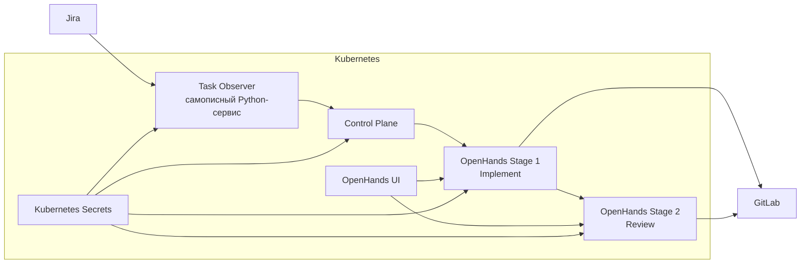
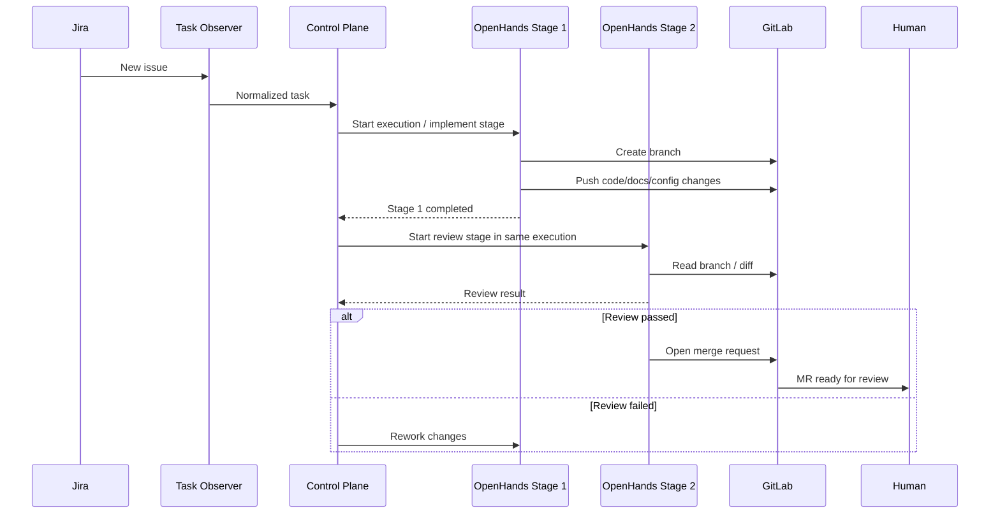

## Context

Платформа должна автоматизировать повторяемые инженерные задачи: получать задачи из Jira, направлять их в OpenHands на реализацию, подготавливать изменения в GitLab и публиковать merge request для human review. Для первой версии принимается простая deployment-модель: OpenHands UI, OpenHands агенты, `task observer` и `control plane` размещаются в Kubernetes. Секреты первой версии хранятся в Kubernetes Secrets. При этом `task observer` должен изначально иметь расширяемую внутреннюю модель, чтобы позже можно было добавлять новые источники задач без перестройки основного execution flow.

Ключевые стейкхолдеры: инженерные команды, platform/devtools команда, владельцы Jira/GitLab интеграций и SRE. Главные ограничения: код хранится в GitLab, основным task source первой версии является Jira, все внутренние компоненты платформы запускаются в Kubernetes.

## Current Architecture

### Baseline Diagram

### Current System Narrative

На текущем этапе уже существуют и зафиксированы внешние опорные системы: Jira как task tracker, GitLab как система хранения кода и Kubernetes как среда запуска OpenHands UI, агентов и внутренних сервисов. Также уже выбран технологический вектор — OpenHands SDK как основа будущего агентного слоя. Однако самой платформы автоматизации как целостной системы пока нет: нет task observer для intake задач, нет единой точки управления исполнением и нет согласованной схемы взаимодействия компонентов внутри Kubernetes.

### Current Constraints and Gaps

- Jira является единственным task source первой версии, но `task observer` должен сохранять возможность подключения дополнительных источников задач в будущем.
- GitLab остается системой записи для кода и результатов реализации.
- Kubernetes уже задан как среда запуска OpenHands UI, агентов и внутренних сервисов, но текущая архитектура пока не фиксирует точную схему размещения компонентов.
- Секреты первой версии должны храниться в Kubernetes Secrets.
- В текущем состоянии отсутствует единый путь прохождения задачи: intake, нормализация, implementation stage, review stage и открытие merge request.

### Why the Current Architecture Is Not Enough

Текущее состояние подходит только как инфраструктурная отправная точка. Оно задает обязательные внешние системы и базовую среду выполнения, но не дает повторяемого способа получать задачи, направлять их в OpenHands и публиковать результат через согласованный execution flow.

## Goals / Non-Goals

**Goals:**
- Построить внутренний контур автоматизации для легких и средних рутинных задач.
- Использовать `task observer` как входной слой для задач из Jira и предусмотреть расширяемый adapter contract для будущих источников задач.
- Разместить OpenHands UI, OpenHands агентов и внутренние сервисы платформы в Kubernetes.
- Использовать Kubernetes Secrets как базовый механизм хранения секретов первой версии.
- Дать единый контракт выполнения: intake задачи, implementation stage, review stage, открытие merge request и human review.

**Non-Goals:**
- Полная автономия агента без политик подтверждения и ограничений.
- Замена Jira или GitLab их внутренними аналогами.
- Поддержка тяжелых долговременных пайплайнов, требующих отдельного workflow engine класса Airflow/Temporal.
- Универсальная интеграция со всеми корпоративными системами в первой версии.
- Отдельная расширенная подсистема аудита, статусов и наблюдаемости в рамках этого изменения.

## Target Architecture Decisions

### Target Architecture Diagram

### Target Execution Sequence

### 1. Ввести task observer и control plane как центральный execution flow

**Решение:** входящие задачи сначала попадают в `task observer`, который реализован как самописный Python-сервис. В первой версии он получает задачи только из Jira, но его внутренняя структура должна поддерживать расширяемый adapter contract для будущих источников. После получения задачи он нормализует ее в единый внутренний формат и передает во внутренний `control plane`. `Control plane` запускает один execution в OpenHands, внутри которого последовательно выполняются `stage 1: implement` и `stage 2: review`.

**Почему:** OpenHands SDK решает задачу агентного исполнения, но не покрывает intake задач и нормализацию входных данных. `Task observer` отделяет слой получения задач от слоя исполнения, а `control plane` дает одну точку координации staged execution без необходимости вводить отдельную multi-agent orchestration модель. Расширяемый adapter contract позволяет не зашивать Jira-специфику в доменную модель навсегда.

**Альтернативы:**
- Пустить задачи напрямую в OpenHands — быстрее на старте, но без устойчивой модели intake и маршрутизации.
- Зашить intake-логику внутрь каждого агентного сценария — приводит к дублированию правил и плохой сопровождаемости.

### 2. Ограничить интеграции до Jira intake и прямого GitLab workflow

**Решение:** `task observer` является единственным компонентом, который взаимодействует с Jira в MVP. При этом внутри `task observer` закладывается adapter contract для будущих источников задач, хотя в первой версии активен только Jira adapter. OpenHands execution напрямую взаимодействует с GitLab для создания branch, публикации изменений и открытия merge request.

**Почему:** это упрощает архитектуру первой версии и убирает лишний интеграционный слой. Jira остается единственным активным источником задач, GitLab — только write-path для OpenHands execution, а расширяемость task observer не требует расширять интеграционный scope уже сейчас.

**Альтернативы:**
- Пускать OpenHands напрямую в Jira — смешивает intake задач и execution.
- Добавлять дополнительные источники задач в MVP — расширяет scope без необходимости.

### 3. Разместить OpenHands UI, staged execution и внутренние сервисы в Kubernetes

**Решение:** OpenHands UI, execution stages `implement` и `review`, `task observer` и `control plane` размещаются в Kubernetes как единый runtime-контур первой версии.

**Почему:** это дает единую deployment-модель и не требует разносить компоненты по разным средам уже на старте.

**Альтернативы:**
- Локальный single-host запуск — подходит для dev/test, но не как базовая модель первой версии.
- Разнос UI, агентов и сервисов по разным средам — усложняет deployment без явной пользы для MVP.

### 4. Использовать Kubernetes Secrets как базовый механизм хранения секретов

**Решение:** секреты для OpenHands, `task observer` и `control plane` хранятся в Kubernetes Secrets и передаются компонентам стандартными механизмами Kubernetes.

**Почему:** это самый простой и понятный способ обеспечить работоспособность первой версии без введения отдельной системы управления секретами.

**Альтернативы:**
- Внешний secrets manager — может понадобиться позже, но усложняет стартовую архитектуру.
- Передача секретов вне стандартных механизмов Kubernetes — хуже управляется.

## Risks / Trade-offs

- **[Недооценка сложности OpenHands в Kubernetes]** → Сразу проверять deployment-модель на реальном кластере.
- **[Слишком широкий набор agent tools]** → В первой версии ограничить каталог разрешенных инструментов.
- **[Review stage не дает достаточно пользы]** → Для MVP ограничить review stage проверкой diff и качества изменений, а финальным gate оставить human review.
- **[Сложность модели авторизации Jira]** → Отдельно согласовать доступы, необходимые task observer и Jira-адаптеру.
- **[Скопление логики в control plane]** → Четко разделить `task observer` и `control plane`, не перенося Jira intake в execution.
- **[Избыточные ожидания от “универсального комбайна”]** → Зафиксировать узкий каталог сценариев первой версии.

## Migration Plan

1. Собрать PoC `task observer` и `control plane` с одним-двумя сценариями автоматизации.
2. Разместить OpenHands UI, implementation stage, review stage и внутренние сервисы в Kubernetes.
3. Настроить Kubernetes Secrets для OpenHands, task observer и control plane.
4. Настроить Jira intake в task observer, зафиксировать adapter contract для будущих task sources и прямой GitLab workflow для OpenHands execution.
5. Провести security/platform review и проверку deployment-модели.

**Rollback strategy:**
- Отключение новых сценариев через конфигурацию платформы.
- Переключение control plane в read-only режим.
- Остановка runtime namespace/pool и отключение внутренних сервисов платформы.

## Open Questions

- Какие именно типы Jira-операций входят в MVP: создание задач, переходы, комментарии, вложения, работа с epic/custom fields?
- Должен ли GitLab-контур первой версии кроме publish-to-branch и MR creation также запускать pipeline и комментировать MR?
- Где будет храниться реестр сценариев автоматизации: в коде, в конфигурации, в отдельном каталоге шаблонов?
- Какие критерии считаются достаточными для прохождения review stage в MVP?
