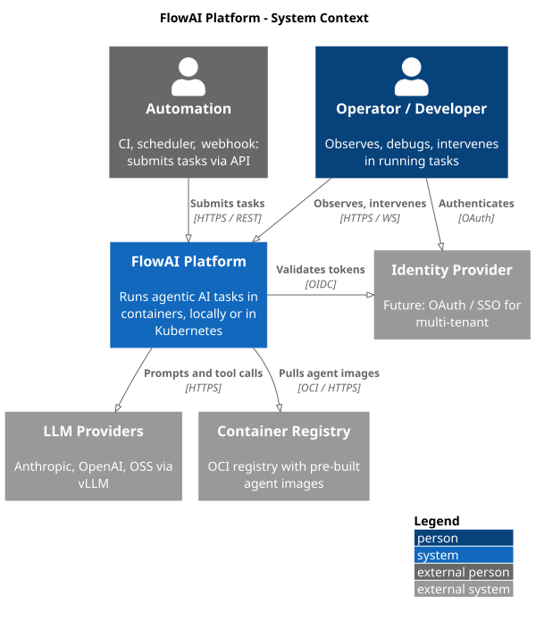
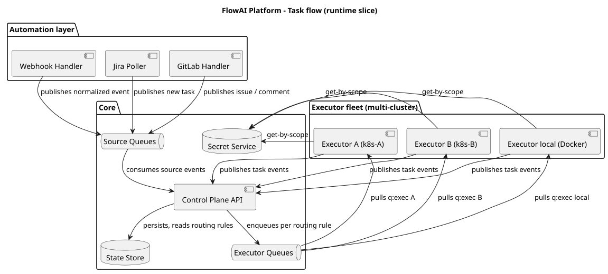
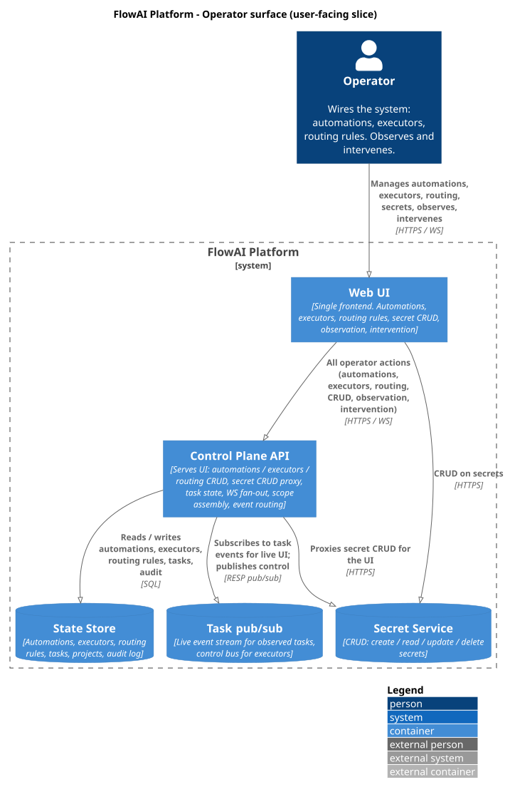
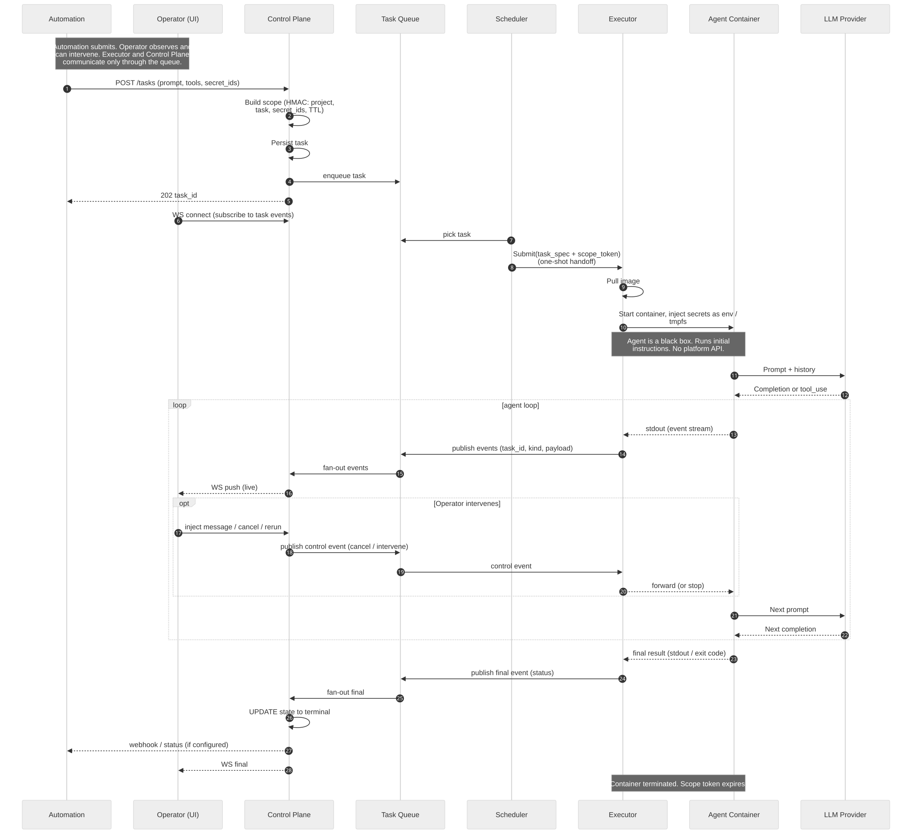
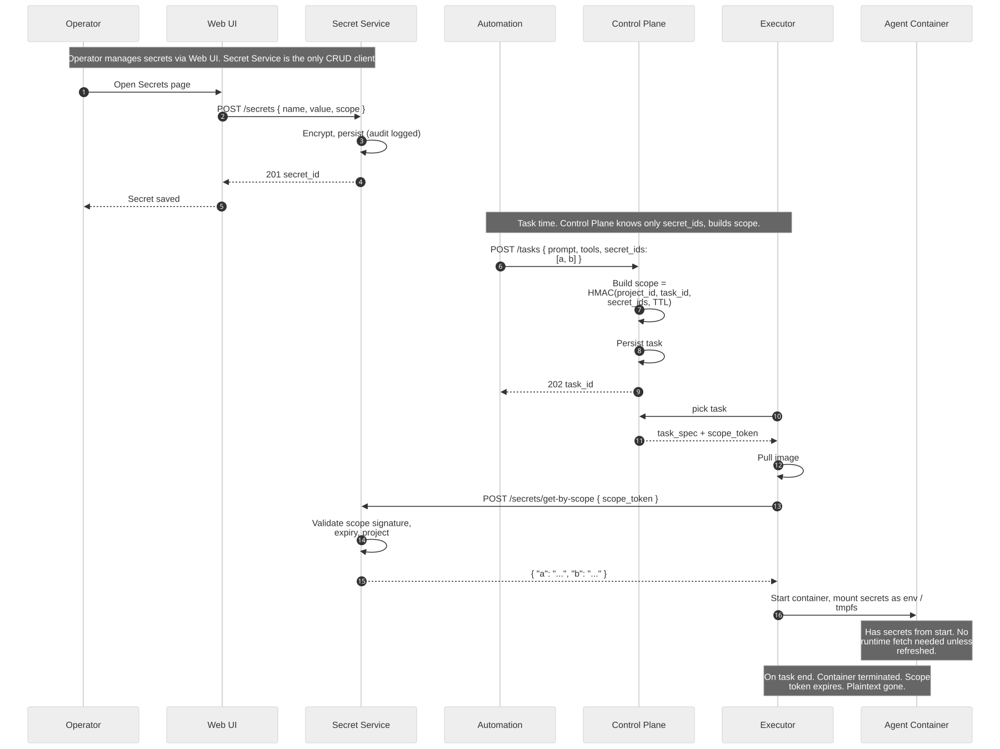

# FlowAI Platform — Architecture

> **Status:** Planning phase. No code written yet.
>
> **One-paragraph summary:** FlowAI is a platform that runs **agentic AI tasks** (LLM + tools, multi-turn) inside containers. Two core services own the data plane: an **API Gateway** (the sole backend for the Web UI — CRUD, WS observation, intervention) and an **Event Router** (a pure queue take-and-put service — picks from the source/event queues, puts onto per-executor queues and the UI fanout queue, no business logic, no DB). An executor daemon starts containers locally or in Kubernetes behind a single interface. Containers run pre-built images of external agent frameworks (OpenHands, Claude Agent SDK, LangGraph, ...) over a defined contract. A state store holds tasks, projects, and audit log; a task queue handles pub/sub and rate limits; a separate Secrets Registry service holds encrypted secrets per user / per project and issues short-lived grant tokens to running containers. OpenTelemetry traces every hop. Deployment is K8s-native via Helm; dev/test runs on k3d.
>
> **Source of truth:** After bootstrap, the source of truth for architecture is [`openspec/specs/`](../../openspec/specs/) (per-capability specs: `task-submission`, `task-routing-execution`, `task-state-transitions`, `task-observation-intervention`, `operator-configuration`, `secret-management-injection`, `event-source-ingestion`). This `architecture.md` is kept as **legacy navigation and rendered-view documentation** — for browsing the prose and embedded diagrams. Edit the OpenSpec specs first; mirror changes here only when the rendered view needs updating.

## System context

Source: [`diagrams/01-context.puml`](diagrams/01-context.puml) (PlantUML)

The platform sits between the user and the agentic-loop world. It owns queuing, isolation, secrets, observability, and cost — and delegates the actual LLM/tool loop to a framework inside a container.

## Task flow (runtime slice)

Source: [`diagrams/02-containers.puml`](diagrams/02-containers.puml) (PlantUML)

Five services that a task touches as it goes from "automation submits" to "task done": the API Gateway (UI backend), the Event Router (queue take-and-put), executors (start containers), plus queues and the state store. No human in this slice.

## Operator surface (user-facing slice)

Source: [`diagrams/03-operator-surface.puml`](diagrams/03-operator-surface.puml) (PlantUML)

What a human touches: Web UI as the single frontend, API Gateway as its backend, Secret Service for CRUD. The UI is the only CRUD client of the Secret Service. The API Gateway is the only backend for the UI. There is no other path for a human to manage secrets, observe a task, or intervene.

Four things live inside the platform: UI, API Gateway, Event Router, and executors — plus the data tier (Postgres + Redis queues). The agent container is per-task and ephemeral.

**API Gateway vs Event Router — separation of concerns:**

- **API Gateway** = stateful backend for the UI. Owns HTTP/WS endpoints, validates input, persists to Postgres, assembles scope tokens, subscribes to the event fanout queue and pushes live events to WS clients. The UI never talks to anyone else.
- **Event Router** = stateless queue take-and-put. Consumes from the source queue (tasks) and the event fanout queue (live events from executors), writes onto per-executor queues (dispatch) and the fanout queue (for the API Gateway to subscribe). It does **not** touch the database and does **not** know about scope tokens or routing rules beyond a small in-memory cache. This means it can be horizontally scaled, restarted, and replaced without losing task state.

## Task lifecycle

Source: [`diagrams/04-sequence-task-lifecycle.puml`](diagrams/04-sequence-task-lifecycle.puml) (PlantUML)

Submit -> validate -> enqueue -> event-router dispatch -> start -> agent loop (LLM + tools) -> finalize -> cleanup. Every hop is traced.

The Event Router sits between the API Gateway and the executors. The API Gateway writes tasks to the source queue and reads from the event fanout queue. The Event Router bridges: source queue -> per-executor queue (dispatch), and executor event stream -> fanout queue (observation). No business logic in the router — pure take-and-put.

## Secret injection

Source: [`diagrams/05-sequence-secrets.puml`](diagrams/05-sequence-secrets.puml) (PlantUML)

Secrets are ciphertext in Postgres, plaintext only inside a tmpfs mounted into the running container, and gone the moment the container stops.

## Task state machine

Source: [`diagrams/06-state-task.puml`](diagrams/06-state-task.puml) (PlantUML)

Every task moves through this state graph. Terminal states are persisted with the full event log so a task can be replayed in the UI.

## What's not in this plan (yet)

Open questions, deferred until implementation:

- **Specific agent framework** — OpenHands vs Claude Agent SDK vs LangGraph. Choice inside a pre-built image.
- **Argo Workflows / Kueue** — useful for fan-out and queuing inside K8s.
- **Artifact storage** — object store / PVC / local fs.
- **Cost / quota enforcement** — token budgets, timeouts, max concurrent tasks.
- **Network policy / egress allowlist** — what can the agent container reach?
- **Tool registry** — which tools are first-class, how they are versioned, how users add their own.
- **Specific tech stack per component** — decided per component at implementation time.

## How to read this document

1. Skim the system context (diagram 01) and the containers (diagram 02). That's the shape.
2. Read the lifecycle (diagram 04) — that is the happy path.
3. To change something, edit the relevant diagram source (`.puml`) and re-render.
4. The `diagrams` skill (in `.opencode/skills/diagrams`) explains how to render and verify.
