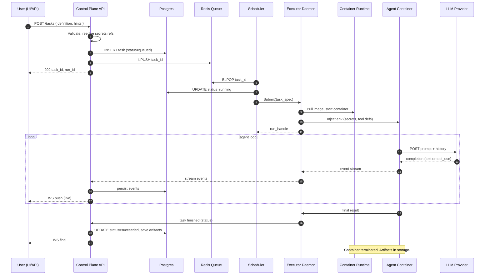
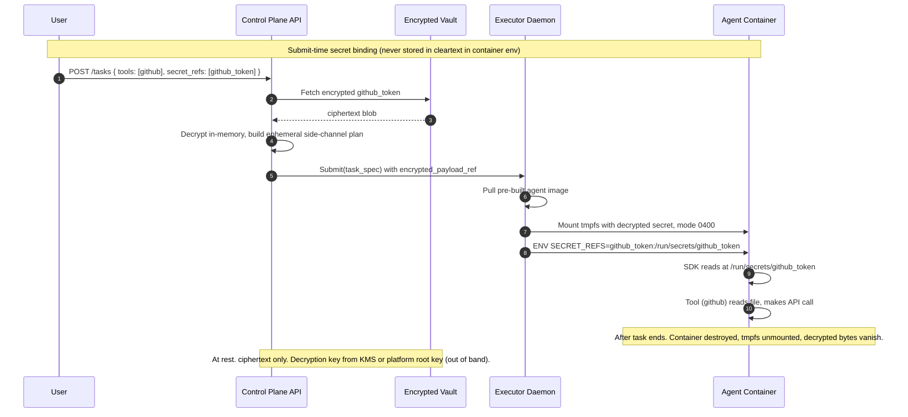
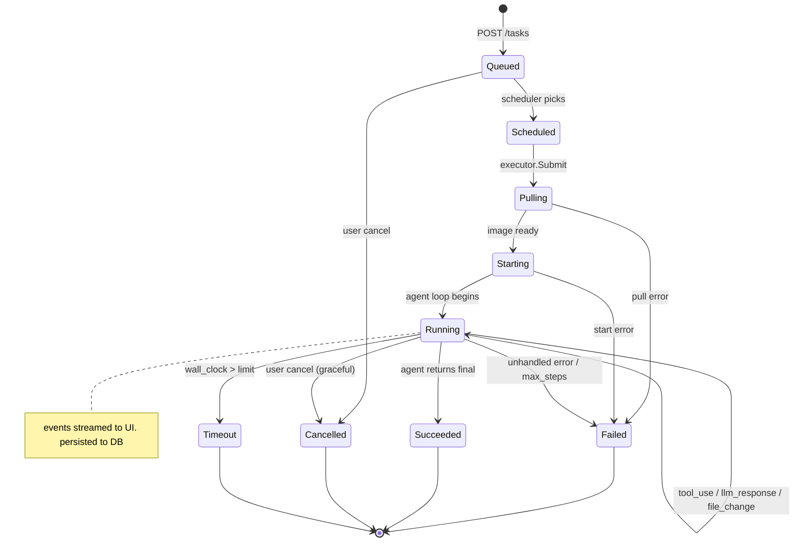

# FlowAI Platform — Architecture

> **Status:** Planning phase. No code written yet.
>
> **One-paragraph summary:** FlowAI is a platform that runs **agentic AI tasks** (LLM + tools, multi-turn) inside containers. A control plane schedules work; an executor daemon starts containers locally or in Kubernetes behind a single interface; a web UI provides a dashboard with live observation and intervention. Containers run pre-built images of external agent frameworks (OpenHands, Claude Agent SDK, LangGraph, ...) over a defined contract. A state store holds tasks, projects, and audit log; a task queue handles pub/sub and rate limits; a separate Secrets Registry service holds encrypted secrets per user / per project and issues short-lived grant tokens to running containers. OpenTelemetry traces every hop. Deployment is K8s-native via Helm; dev/test runs on k3d.

## System context

Source: [`diagrams/01-context.puml`](diagrams/01-context.puml) (PlantUML)

The platform sits between the user and the agentic-loop world. It owns scheduling, isolation, secrets, observability, and cost — and delegates the actual LLM/tool loop to a framework inside a container.

## Task flow (runtime slice)

Source: [`diagrams/02-containers.puml`](diagrams/02-containers.puml) (PlantUML)

Five services that a task touches as it goes from "automation submits" to "task done", plus the per-task agent container. No human in this slice.

## Operator surface (user-facing slice)

Source: [`diagrams/03-operator-surface.puml`](diagrams/03-operator-surface.puml) (PlantUML)

What a human touches: Web UI as the single frontend, Control Plane API as its backend, Secret Service for CRUD. The UI is the only CRUD client of the Secret Service. The Control Plane is the only backend for the UI. There is no other path for a human to manage secrets, observe a task, or intervene.

Five things live inside the platform: UI, control plane API, scheduler, executor, and the data tier (Postgres + Redis). The agent container is per-task and ephemeral.

## Task lifecycle

Source: [`diagrams/04-sequence-task-lifecycle.mmd`](diagrams/04-sequence-task-lifecycle.mmd)

Submit -> validate -> enqueue -> pick -> start -> agent loop (LLM + tools) -> finalize -> cleanup. Every hop is traced.

## Secret injection

Source: [`diagrams/05-sequence-secrets.mmd`](diagrams/05-sequence-secrets.mmd)

Secrets are ciphertext in Postgres, plaintext only inside a tmpfs mounted into the running container, and gone the moment the container stops.

## Task state machine

Source: [`diagrams/06-state-task.mmd`](diagrams/06-state-task.mmd)

Every task moves through this state graph. Terminal states are persisted with the full event log so a task can be replayed in the UI.

## What's not in this plan (yet)

Open questions, deferred until implementation:

- **Specific agent framework** — OpenHands vs Claude Agent SDK vs LangGraph. Choice inside a pre-built image.
- **Argo Workflows / Kueue** — useful for fan-out and queuing inside K8s.
- **Artifact storage** — object store / PVC / local fs.
- **Cost / quota enforcement** — token budgets, timeouts, max concurrent tasks.
- **Network policy / egress allowlist** — what can the agent container reach?
- **Tool registry** — which tools are first-class, how they are versioned, how users add their own.
- **Specific tech stack per component** — decided per component at implementation time.

## How to read this document

1. Skim the system context (diagram 01) and the containers (diagram 02). That's the shape.
2. Read the lifecycle (diagram 04) — that is the happy path.
3. To change something, edit the relevant diagram source (`.puml` / `.mmd`) and re-render.
4. The `diagrams` skill (in `.opencode/skills/diagrams`) explains how to render and verify.
